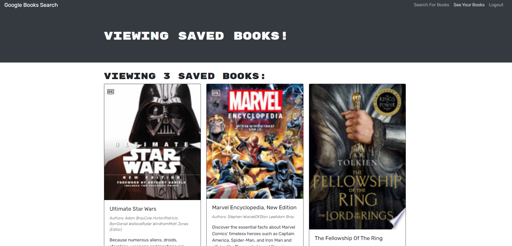

## Book Search Engine

## Description

This application was built around Google Books API search engine using GraphQL API and Apollo Server. The app is following the MERN stack with a React front end, MongoDB database, and Node.js/Express.js server and API. Users can save books to their profile and delete them if needed. 
Building this application provided challenges and helped me to better understand how to create a MERN application.

## Table of Contents 

- [Installation](#installation)
- [Usage](#usage)
- [Badges](#badges)
- [Links](#links)

## Installation

To run locally:
* Fork the https://github.com/bordanattila/Book_Search-Engine repo.
* Open the forked folder in your IDE on your computer.
* Open the parent folder of the project in your terminal.
* Install the node dependencies by entering in the terminal `npm install`
* Then enter `npm run develop` to see in the browser. 

## Usage

## :trophy: Badges

  

## Links

[My GitHub Profile](https://github.com/attila)  
[Deployed Application](https://attilabooksearch.herokuapp.com/)